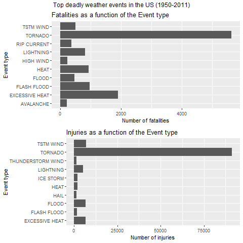

Health and Economic Impact of Weather Events in the US
======================================================


Storms and other severe weather events can cause both public health and economic
problems for communities and municipalities. Many severe events can result in
fatalities, injuries, and property damage, and preventing such outcomes to the extent
possible is a key concern.

This project involves exploring the U.S. National Oceanic and Atmospheric
Administration's (NOAA) storm database. This database tracks characteristics of major
storms and weather events in the United States, including when and where they occur, as
well as estimates of any fatalities, injuries, and property damage.

Synopsis
========

The analysis on the storm event database revealed that tornadoes are the most
dangerous weather event to the population health. The second most dangerous
event type is the excessive heat. The economic impact of weather events was
also analyzed. Flash floods and thunderstorm winds caused billions of dollars
in property damages between 1950 and 2011. The largest crop damage caused by
drought, followed by flood and hails.


Data Processing
===============

The analysis was performed on
[Storm Events Database](http://www.ncdc.noaa.gov/stormevents/ftp.jsp), provided by
[National Climatic Data Center](http://www.ncdc.noaa.gov/). The data is from a comma-separated-value file available
[here](https://d396qusza40orc.cloudfront.net/repdata%2Fdata%2FStormData.csv.bz2).
There is also some documentation of the data available
[here](https://d396qusza40orc.cloudfront.net/repdata%2Fpeer2_doc%2Fpd01016005curr.pdf).

The first step is to read the data into a data frame.


```{r}
dat <- read.csv('data/repdata_data_StormData.csv.bz2')
```
Before the analysis, the data need some preprocessing. Event types don't have a
specific format. For instance, there are events with types `Frost/Freeze`,
`FROST/FREEZE` and `FROST\\FREEZE` which obviously refer to the same type of
event.


```{r}
# number of unique event types
length(unique(dat$EVTYPE))
```

```
## [1] 985
```

```{r}
event_types <- dat$EVTYPE
event_types <- gsub("[[:blank:][:punct:]+]", " ", event_types)
#Update the data frame
dat$EVTYPE <- event_types

```
No further data preprocessing was performed although the event type field can be
processed further to merge event types such as `tstm wind` and `thunderstorm wind`. 
After the cleaning, as expected, the number of unique event types reduce
significantly. For further analysis, the cleaned event types are used.


Dangerous Events with respect to Population Health
================================================

To find the event types that are most harmful to population health, the number
of casualties are aggregated by the event type.

```{r}
library(dplyr)
eventype_fatalities <- as.data.frame(dat %>% group_by(EVTYPE) %>% summarise(fatalities = sum(FATALITIES), injuries = sum(INJURIES)))
```
```{r}
#We yield the top 10 most fatal event types
head(eventype_fatalities[order(eventype_fatalities$fatalities, decreasing = TRUE), c('EVTYPE', "fatalities")], 10)
```
```
##          EVTYPE         fatalities
##826        TORNADO       5633
##124 EXCESSIVE HEAT       1903
##151    FLASH FLOOD        978
##271           HEAT        937
##453      LIGHTNING        816
##846      TSTM WIND        504
##167          FLOOD        470
##572    RIP CURRENT        368
##343      HIGH WIND        248
##19       AVALANCHE        224
```
```{r}
#We yield the top 10 event types which caused more injuries
head(eventype_fatalities[order(eventype_fatalities$injuries, decreasing = TRUE), c("EVTYPE","injuries")], 10)
```
```
##            EVTYPE     injuries
##826           TORNADO    91346
##846         TSTM WIND     6957
##167             FLOOD     6789
##124    EXCESSIVE HEAT     6525
##453         LIGHTNING     5230
##271              HEAT     2100
##422         ICE STORM     1975
##151       FLASH FLOOD     1777
##753 THUNDERSTORM WIND     1488
##241              HAIL     1361
```
Economic Effects of Weather Events
==================================

To analyze the impact of weather events on the economy, available property
damage and crop damage reportings/estimates were used.

In the raw data, the property damage is represented with two fields, a number
`PROPDMG` in dollars and the exponent `PROPDMGEXP`. Similarly, the crop damage
is represented using two fields, `CROPDMG` and `CROPDMGEXP`. The first step in the
analysis is to calculate the property and crop damage for each event.
```{r}
#Let's first create a function which will return the exponent digit given a letter indicating the exponent
exp_function <- function(x){
  if(x %in% c('k', 'K')){
    return(3)
  }
  else if(x %in% c('M', 'm')){
    return(6)
  }
  else if(x %in% c('B', 'b')){
    return(9)
  }
  else if(x %in% c('h','H')){
    return(2)
  }
  else if(!is.na(as.numeric(x))){
    return(as.numeric(x))
  }
  else if(x %in% c('', '-', '?', '+')){
    return(0)
  }
  else{
    stop('Invalid entry')
  }
}
#Now let's add this changes to our original data file
prop_dmg_exp <- sapply(dat$PROPDMGEXP, FUN = exp_function)
dat$prop_dmg <- dat$PROPDMG * (10**prop_dmg_exp)
crop_dmg_exp <- sapply(dat$CROPDMGEXP, FUN = exp_function)
dat$crop_dmg <- dat$CROPDMG * (10**crop_dmg_exp)


#Next, let's calculate the total economic loss per event type
econ_loss <- as.data.frame(dat %>% group_by(EVTYPE) %>% summarise(crop_loss = sum(crop_dmg), prop_loss = sum(prop_dmg)))
```
```{r}
#We yield the top 10 event types that caused the highest crop losses
head(econ_loss[order(econ_loss$crop_loss, decreasing = TRUE),c('EVTYPE','crop_loss')], 10)
```
```
##            EVTYPE   crop_loss
##91            DROUGHT 13972566000
##167             FLOOD  5661968450
##577       RIVER FLOOD  5029459000
##422         ICE STORM  5022113500
##241              HAIL  3025954473
##385         HURRICANE  2741910000
##393 HURRICANE/TYPHOON  2607872800
##151       FLASH FLOOD  1421317100
##132      EXTREME COLD  1292973000
##198      FROST/FREEZE  1094086000
```
```{r}
#We now yield the top 10 event types which caused the highest property losses
head(econ_loss[order(econ_loss$prop_loss, decreasing = TRUE),c('EVTYPE','prop_loss')], 10)
```
```
##             EVTYPE    prop_loss
##167             FLOOD 144657709807
##393 HURRICANE/TYPHOON  69305840000
##826           TORNADO  56947380677
##656       STORM SURGE  43323536000
##151       FLASH FLOOD  16822673979
##241              HAIL  15735267513
##385         HURRICANE  11868319010
##839    TROPICAL STORM   7703890550
##962      WINTER STORM   6688497251
##343         HIGH WIND   5270046295
```
Results
=======

Health impact of weather events
-------------------------------

The following plot shows top dangerous weather event types. Here, we will only consider the op 10 most fatal disasters type
```{r}
library(ggplot2)
library(gridExtra)
eventype_fatalities_filter <- eventype_fatalities[order(eventype_fatalities$fatalities, decreasing = TRUE),]
eventype_injuries_filter <- eventype_fatalities[order(eventype_fatalities$injuries, decreasing = TRUE),]

p1 <- ggplot(data = head(eventype_fatalities_filter,10), aes(x = EVTYPE, y = fatalities)) + geom_bar(stat = 'identity') + labs(x = 'Event type', y = 'Number of fatalities', title = 'Fatalities as a function of the Event type') + coord_flip()
p2 <- ggplot(data = head(eventype_injuries_filter,10), aes(x = EVTYPE, y = injuries)) + geom_bar(stat = 'identity') + labs(x = 'Event type', y = 'Number of injuries', title = 'Injuries as a function of the Event type') + coord_flip()
grid.arrange(p1, p2, top="Top deadly weather events in the US (1950-2011)")
```
 
